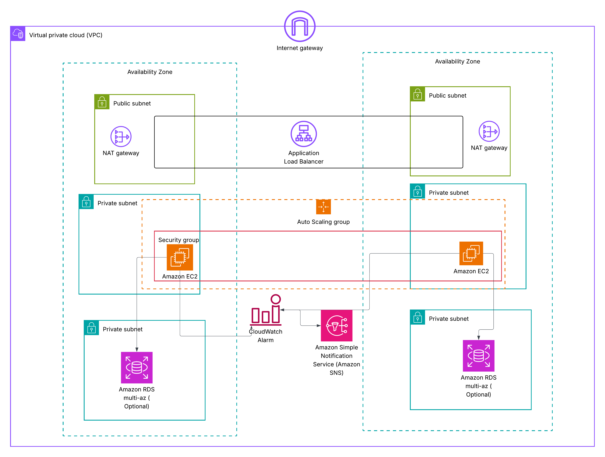

# Scalable Web Application on AWS (ALB + Auto Scaling)

## 📌 Project Overview

This project demonstrates how to deploy a highly available and scalable web application on AWS using:

- Amazon EC2
- Application Load Balancer (ALB)
- Auto Scaling Group (ASG)
- Amazon VPC (Multi-AZ)
- NAT Gateway
- Amazon CloudWatch
- Amazon SNS
- (Optional) Amazon RDS Multi-AZ

The infrastructure is provisioned using AWS CloudFormation : 

---

## 🏗 Architecture

The architecture follows AWS best practices:

- Multi-AZ deployment
- Public subnets for ALB and NAT Gateway
- Private subnets for EC2 instances
- Auto Scaling for elasticity
- CloudWatch monitoring
- SNS notifications for alerts

See the architecture diagram in `/architecture`.

---

## ⚙️ Technologies Used

- AWS EC2
- AWS ALB
- AWS Auto Scaling
- AWS CloudFormation
- AWS CloudWatch
- AWS SNS
- Node.js (simple web app)

---

## 🚀 Deployment Steps

1. Upload the CloudFormation file in AWS CloudFormation.
2. Provide your email for SNS notifications.
3. Deploy the stack.
4. Confirm SNS email subscription.
5. Access the application using the ALB DNS output.

---

## 📈 Scaling

The Auto Scaling Group uses Target Tracking Scaling based on:

- Average CPU Utilization
- Target: 50%

---

## 🔐 Security

- EC2 instances are in private subnets.
- Only ALB can access EC2.
- No public SSH access.
- NAT Gateway allows outbound internet access.

---

## 📊 Monitoring

- CloudWatch Alarm monitors CPU utilization.
- SNS sends email alerts if CPU > 70%.

---

